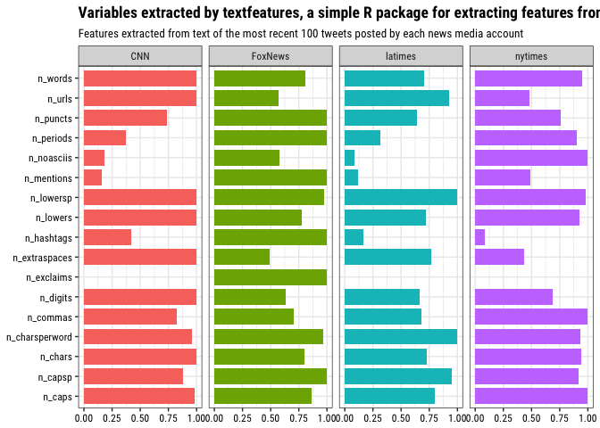

textfeatures
------------

A simple package for extracting useful features from character objects.

Install
-------

``` r
## download devtools if necessary
if (!requireNamespace("devtools", quietly = TRUE)) {
  install.packages("devtools")
}

## install from github
devtools::install_github("mkearney/textfeatures")
```

Usage
-----

### Input: `character`

``` r
## vector of some text
x <- c(
  "this is A!\t sEntence https://github.com about #rstats @github",
  "doh", "THe following list:\n- one\n- two\n- three\nOkay!?!"
)

## get text features
textfeatures(x)
```

    ## # A tibble: 3 x 17
    ##   n_chars n_commas n_digits n_exclaims n_extraspaces n_hashtags n_lowers
    ##     <int>    <int>    <int>      <int>         <int>      <int>    <int>
    ## 1      21        0        0          1             3          1       18
    ## 2       3        0        0          0             0          0        3
    ## 3      38        0        0          2             4          0       28
    ## # ... with 10 more variables: n_lowersp <dbl>, n_mentions <int>,
    ## #   n_periods <int>, n_urls <int>, n_words <int>, n_caps <int>,
    ## #   n_noasciis <int>, n_puncts <int>, n_capsp <dbl>, n_charsperword <dbl>

### Input: `data.frame`

``` r
## data frame with up to one hundred tweets
rt <- rtweet::search_tweets("rstats", n = 100, verbose = FALSE)

## get text features
textfeatures(rt)
```

    ## # A tibble: 100 x 17
    ##    n_chars n_commas n_digits n_exclaims n_extraspaces n_hashtags n_lowers
    ##      <int>    <int>    <int>      <int>         <int>      <int>    <int>
    ##  1      36        0        0          0             2          2       34
    ##  2      64        0        0          1             2          2       50
    ##  3     108        1        1          0             2          0       94
    ##  4      37        0        4          0             2          2       25
    ##  5      73        1        4          0             2          1       54
    ##  6     108        1        1          0             2          0       94
    ##  7     111        0        0          0             1          0       91
    ##  8     108        1        1          0             2          0       94
    ##  9      74        0        1          0             2          1       57
    ## 10      47        0        0          0             2          3       38
    ## # ... with 90 more rows, and 10 more variables: n_lowersp <dbl>,
    ## #   n_mentions <int>, n_periods <int>, n_urls <int>, n_words <int>,
    ## #   n_caps <int>, n_noasciis <int>, n_puncts <int>, n_capsp <dbl>,
    ## #   n_charsperword <dbl>

### Input: `grouped_df`

``` r
## data frame with up to one hundred tweets for each of 5 users
gdf <- rtweet::get_timelines(
  c("wapo", "cnn", "nytimes", "foxnews", "latimes"), n = 100)

## group by screen_name and return text features
f <- textfeatures(dplyr::group_by(gdf, screen_name))

## load ggplot
suppressPackageStartupMessages(library(tidyverse))

## standardize function
scale_standard <- function(x) {
  (x - 0) / (max(x, na.rm = TRUE) - 0)
}

## convert to long (tidy) form and plot
f %>%
  mutate_if(is.numeric, scale_standard) %>%
  gather(var, val, -screen_name) %>%
  ggplot(aes(x = var, y = val, fill = screen_name)) + 
  geom_col(width = .8) + 
  theme_bw(base_family = "Roboto Condensed") + 
  facet_grid(. ~ screen_name) + 
  coord_flip() + 
  theme(legend.position = "none",
    axis.text = element_text(colour = "black"),
    plot.title = element_text(face = "bold")) + 
  labs(y = NULL, x = NULL,
    title = "Variables extracted by textfeatures, a simple R package for extracting features from text",
    subtitle = "Features extracted from text of the most recent 100 tweets posted by each news media account")
```


